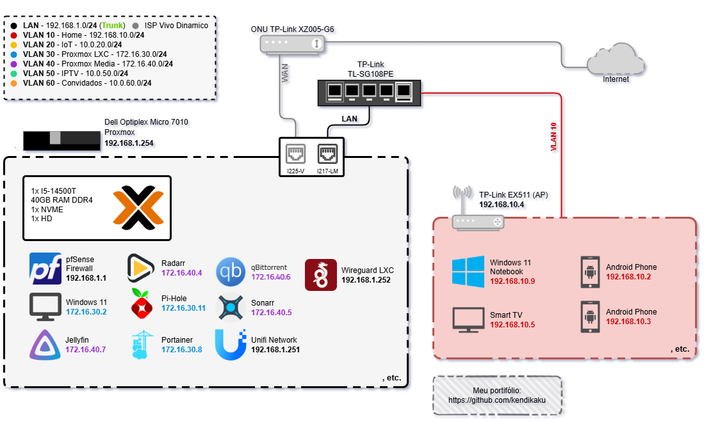

# 🏡 HomeLab - Infraestrutura Pessoal com Proxmox & DevOps

Este repositório documenta minha infraestrutura de homelab utilizando **Proxmox VE**, com **VMs**, **containers LXC**, **VLANs** e serviços em rede, configurados com foco em **DevOps**, **segurança**, **automação** e **virtualização eficiente**.

> 💡 Montado em um **Dell OptiPlex 7010 Micro**, este projeto visa simular ambientes corporativos reais, com práticas modernas de DevOps e Infraestrutura

---

## 🗺️ Diagrama da Infraestrutura



---

## 📁 Estrutura do Projeto

```text
homelab-proxmox-pfsense-vlans/
├── docs/                     # Documentação detalhada por tópico
│   ├── samba-config.md
│   ├── permissao-lxc-jellyfin.md
│   ├── gerenciamento-usuarios-samba.md
│   ├── montar-lxc-nao-privilegiado.md
│   ├── backup-proxmox-onedrive.md
│   ├── agendar-backup-cron.md
│   ├── permissoes-acl.md
│   ├── redimensionar-lv-root.md
│   ├── raid1-btrfs-proxmox.md
│   ├── adicionar-discos-usb-vm.md
│   ├── passthrough-nic-vfio.md
│   ├── instalacao-drivers.md
│   ├── diagrama-infra.png
│   ├── vlans-docker-debian.md
│   ├── docker-stack.md
│   └── configurar-rclone-onedrive.md
├── scripts/                 # Scripts úteis e automatizados
│   ├── backup_proxmox.sh
│   ├── criar-raid1-btrfs.sh
│   ├── instalar-drivers.bat
│   └── redimensionar-lv-root.sh
├── docker-compose.yaml
├── environment_publico.env
└── README.md
```

---

## 📚 Documentações

- [Configuração do Samba](docs/samba-config.md)
- [Permissões para LXC e Jellyfin](docs/permissao-lxc-jellyfin.md)
- [Gerenciar usuários Samba](docs/gerenciamento-usuarios-samba.md)
- [Montar diretórios no LXC](docs/montar-lxc-nao-privilegiado.md)
- [Backup com Rclone + Telegram](docs/backup-proxmox-onedrive.md)
- [Agendamento de Backup com Cron](docs/agendar-backup-cron.md)
- [Permissões ACL detalhadas](docs/permissoes-acl.md)
- [Configurar Rclone com OneDrive](docs/configurar-rclone-onedrive.md)
- [Redimensionar LV Root Proxmox](docs/redimensionar-lv-root.md)
- [Criar RAID1 via Btrfs no Proxmox](docs/raid1-btrfs-proxmox.md)
- [Adicionar discos USB na VM Passthrough](docs/adicionar-discos-usb-vm.md)
- [Configurar NIC para Passthrough no Proxmox (VFIO)](docs/passthrough-nic-vfio.md)
- [Instalação Automática de Drivers no Windows](docs/instalacao-drivers.md)
- [Docker Stack Multimídia e Infraestrutura](docs/docker-stack.md)
- [Configuração de VLANs e IP Forwarding em VM Docker Debian](docs/vlans-docker-debian.md)

---

## 🔧 Scripts

- [`backup_proxmox.sh`](scripts/backup_proxmox.sh) — Sincroniza backups do Proxmox com o OneDrive e envia notificação para o Telegram.
- [`redimensionar-lv-root.sh`](scripts/redimensionar-lv-root.sh) — Script para remover LV data e expandir LV root no Proxmox.
- [`criar-raid1-btrfs.sh`](scripts/criar-raid1-btrfs.sh) — Script para remover LV data e expandir LV root no Proxmox.
- [`configurar-passthrough-nic.sh`](scripts/configurar-passthrough-nic.sh) — Script para configurar VFIO passthrough de NICs no Proxmox.
- [`instalar-drivers`](scripts/instalar-drivers.bat) — Script de Instalação Automática de Drivers no Windows.

---

## 🚀 Como começar

1. Clone este repositório:
   ```bash
   git clone https://github.com/kendikaku/homelab-proxmox-pfsense-vlans.git
   cd homelab-proxmox-pfsense-vlans
   ```
2. Acesse a documentação em `docs/` para seguir as configurações passo a passo.
3. Execute os scripts conforme necessário a partir da pasta `scripts/`.

---

## ⚙️ Infraestrutura Geral

* 🖥️ **Host**: Dell OptiPlex 7010 Micro
  * CPU: Intel i5-14500T
  * RAM: 40GB DDR4
  * Armazenamento:
    * NVMe 1TB (Proxmox, VMs e LXCs)
    * HD Externo 4TB (backups, ISOs, templates e dados compartilhados)
* 🔁 **Backup**:
  * Realizado diretamente no Proxmox
  * Cópia automática via **rclone** para **OneDrive** com notificações via **Telegram**
* 📦 **Virtualização**:
  * Proxmox VE como hypervisor
  * pfSense e Windows 11 virtualizados
  * LXCs não privilegiados com permissões ACL
* 🧰 **Planejamento futuro**:
  * Substituir por OptiPlex 7020 com 2 slots NVMe (mirror ZFS para redundância)

---

## 🌐 VLANs e Rede

| VLAN | Nome          | Função                                                     |
| ---- | ------------- | ---------------------------------------------------------- |
| 10   | Home          | Rede doméstica com controle de acesso e aliases confiáveis |
| 20   | IoT           | Rede para dispositivos inteligentes                        |
| 30   | Proxmox LXC   | Infraestrutura LXC (administração e serviços internos)     |
| 40   | Proxmox Media | Serviços de mídia, indexadores e streamers                 |
| 50   | IPTV          | Dispositivos IPTV com acesso limitado ao Jellyfin          |
| 60   | Convidados    | Rede isolada para visitantes                               |
| LAN  | Gerência      | Interface de administração (sem DHCP)                      |

### 🔐 Regras de Firewall

* VLAN 10:
  * Acesso interno liberado
  * Acesso à internet por regra final
  * Bloqueio de outras VLANs, exceto IPs confiáveis via alias
* VLAN 50:
  * Acesso específico ao Jellyfin via IP/MAC fixo
* Outras VLANs:
  * Padrão de bloqueio cruzado e acesso interno

### 🌍 NATs Ativos

* WireGuard: porta UDP configurada manualmente
* Porta aberta para acesso remoto autenticado via sistema PTA

### 🌐 DNS

* DNS Forwarder ativado no pfSense
* Pi-hole rodando em LXC com **Unbound Recursivo**
* Fallbacks: Google e Cloudflare

---

## 🧩 Serviços em Containers (LXCs)

| Serviço             | VLAN | Função                         |
| ------------------- | ---- | ------------------------------ |
| **Bazarr**          | 40   | Legendas automáticas           |
| **Prowlarr**        | 40   | Indexadores para Radarr/Sonarr |
| **Radarr**          | 40   | Filmes                         |
| **Sonarr**          | 40   | Séries                         |
| **qBittorrent**     | 40   | Cliente torrent                |
| **Jellyfin**        | 40   | Streaming local                |
| **Jellyseerr**      | 40   | Interface de pedidos de mídia  |
| **UniFi Network**   | 30   | Gerenciamento de rede Wi-Fi    |
| **Code-server**     | 30   | VS Code via browser            |
| **Filebrowser**     | 30   | Gerenciador de arquivos        |
| **Cloudflare-DDNS** | 30   | Atualização dinâmica de DNS    |
| **Portainer**       | 30   | Orquestração de containers     |
| **Pi-hole**         | 30   | DNS + bloqueio de anúncios     |
| **WireGuard**       | N/A  | VPN                            |

---

## 🔌 Switch TP-Link TL-SG108PE

* **802.1Q VLAN Tagging**:
  * VLAN 1: portas 1 e 8 untagged (padrão)
  * VLAN 10: portas 2–5 untagged; 1 e 8 tagged
  * VLAN 20: porta 6 untagged; 1 e 8 tagged
  * VLAN 50: porta 7 untagged; 1 e 8 tagged
  * VLAN 60: somente 1 e 8 tagged
* **PVIDs**:
  * Portas 1 e 8: VLAN 1
  * Portas 2–5: VLAN 10
  * Porta 6: VLAN 20
  * Porta 7: VLAN 50
* **Loop Prevention** ativado

---

## 📡 Futuro

* Instalação de AP UniFi U7 Pro
* Segmentação de Wi-Fi por VLAN
* Monitoramento com Grafana + Prometheus
* Automação com Ansible
* Migração para setup com Proxmox + ZFS Mirror

---

## 💬 Contato

**Richard**  
Estudante de Engenharia da Computação (UNIVESP)  
Focado em Infraestrutura, DevOps, Homelabs e Linux  
🔗 [LinkedIn](https://www.linkedin.com/in/richardkendikaku)  
📂 [GitHub](https://github.com/kendikaku)

> 🧠 *“Quem domina o lab, domina o caos.”*
